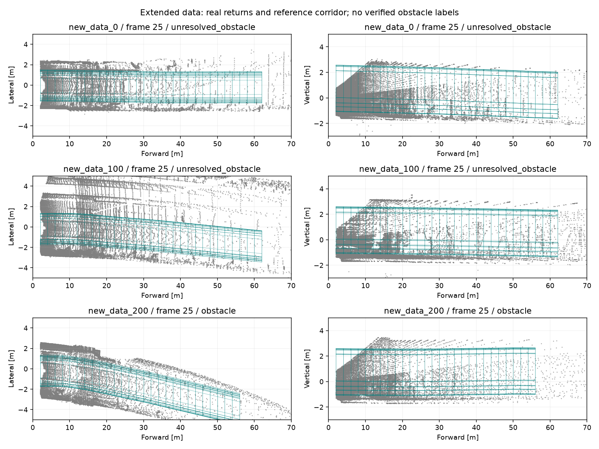

# Extended dataset: first actual runs — 2026-09-18

## What arrived

`bags.zip` contains `bags/new_data.zst`, a tar stream holding one ROS2 recording:

- 221 SQLite segments, `new_data_0.db3` through `new_data_220.db3`.
- 11,271 messages, about 1,199.88 seconds of recorded time.
- Only `/lidar_points` (`sensor_msgs/msg/PointCloud2`); no IMU, odometry or labels in the archive inventory.
- Total unpacked member size: 90,121,539,170 bytes (about 83.93 GiB). ZIP is about 16.9 GB.

Only about 10 GiB was free initially. The complete archive was inventoried through a ZIP → Zstandard → tar stream, without writing the intermediate 17 GB compressed file. Three predetermined segments (0, 100, 200) were extracted, about 1.14 GiB total. Raw archive and other project data were retained. Free space later fell to about 5.2 GiB; no further bulk extraction was attempted.

Do not unpack the complete archive on this volume. A full local extraction needs roughly 84 GiB plus operational headroom. The initial runs and their artifacts use about 170 MiB beyond the extracted segments.

## Reproducible partial views

Each selected segment remains byte-for-byte unchanged; SHA256 hashes and archive member names are in `data/extended_subset/extraction.json` and the versioned result. `tunnel_guard.prepare_segment` creates a one-segment metadata view, checking message count, starting record timestamp and topic schema against the original metadata. It records the original segment index, preceding message count and explicit partial-recording scope.

Original message offsets are 0, 5100 and 10200. Each selected segment has 51 messages. Frame numbers in run JSON are local to the segment. The tracker starts separately for each segment; these are not concatenated across their long gaps. No exact timestamp overlaps were found against the earlier 798-frame panel, but this alone does not establish independent scenes or absence of overlap elsewhere in the complete corpus.

## Sensor and time findings

The sampled messages use frame `hesai_lidar`, 307200 point slots, 26 bytes per point, and scalar x/y/z, intensity, ring, timestamp fields. Current decoding succeeds. First sampled valid-return counts are 159162 / 178890 / 189478; padded/invalid slots are not valid reflections.

First three acquisitions in each segment are spaced approximately 0.1 s apart. Point timestamp spans are approximately 0.032 s; this is not sufficient to verify scan timing or deskew. Cloud acquisition timestamps are still in the year-2000 epoch while bag record timestamps are in 2026. Keep clock domains separate and deskew disabled pending evidence.

Segment 200 also contains an actual acquisition gap of 3.999989 s before local frame 11 (record-time gap 3.817165 s). The detector resets temporal state there. Saved confirmation histories contain no future or duplicate measurement timestamps.

## Frozen detector versus frozen previous geometry

No detection thresholds, installation transform or geometry parameters were tuned to these samples. Both recipes processed all 153 selected real clouds.

| Segment | Current geometry valid | Previous geometry valid | Median support-height proxy | Confirmed intersection observations previous → current |
|---|---:|---:|---:|---:|
| 0 | 51/51 | 51/51 | 1.0707 m | 5 → 8 |
| 100 | 51/51 | 51/51 | 1.0925 m | 0 → 0 |
| 200 | 50/51 | 50/51 | 1.0930 m | 217 → 27 |

Height is supported on 51 / 51 / 49 frames respectively. These estimates are close to the reported 1.075 m empty/stationary reference, but applicability and body extrinsics remain unverified.

Both versions fail to establish paired rails on segment 200, local frame 48, despite a supported bed plane. It is an unresolved geometry failure, not an introduced regression or a clear-route result. The detector currently suppresses object formation when complete rail geometry is unavailable; retaining uncertain objects through such failures remains a priority.

Counts above are repeated algorithmic observations, not independent obstacles or false positives. There are no labels in this archive, so neither the large reduction in segment-200 intersections nor the increase in segment 0 establishes improved accuracy. This is an initial sample of 153/11271 clouds, not full-corpus evaluation.



The figure uses real saved frame-25 geometry clouds; gray is measured support and teal is the reference corridor. Display points are subsampled only for plotting. Obstacle identities are unverified. The figure was visually inspected.

## Commands and artifacts

Commands below use `.venv-iteration/bin/python`. Original metadata was recovered during streaming inventory into `build/extended-inventory/source-metadata.yaml`; extracted SQLite files must already exist. `prepare_segment` refuses to overwrite metadata/provenance.

```sh
python -m tunnel_guard.prepare_segment data/extended_subset/new_data_0/new_data_0.db3 --source-metadata build/extended-inventory/source-metadata.yaml
python -m tunnel_guard.prepare_segment data/extended_subset/new_data_100/new_data_100.db3 --source-metadata build/extended-inventory/source-metadata.yaml
python -m tunnel_guard.prepare_segment data/extended_subset/new_data_200/new_data_200.db3 --source-metadata build/extended-inventory/source-metadata.yaml
python -m tunnel_guard.inspect_bag data/extended_subset/new_data_0 --config configs/detector-native.json --max-frames 3 --output build/extended-inventory/segment-0-layout.json
python -m tunnel_guard.inspect_bag data/extended_subset/new_data_100 --config configs/detector-native.json --max-frames 3 --output build/extended-inventory/segment-100-layout.json
python -m tunnel_guard.inspect_bag data/extended_subset/new_data_200 --config configs/detector-native.json --max-frames 3 --output build/extended-inventory/segment-200-layout.json
python -m tunnel_guard.run --experiment configs/extended-prefix.json
python -m tunnel_guard.run --experiment configs/extended-measured.json
python -m tunnel_guard.run --experiment configs/extended-baseline.json
python -m tunnel_guard.panel_report --panel configs/extended-panel.json --output build/extended-comparison.json
git diff --check
```

Complete per-frame results, source snapshots and manifests remain under `build/extended-*`. Compact evidence and the full archive member inventory: `results/extended-first-look-20260918.json`. `bags.zip` is explicitly ignored by Git. No automated tests, ROS runtime, RViz GUI or ML training were run.

Next work: inspect the shared rail failure at segment 200/frame 48 and the large intersection changes with point support; establish event labels and coverage intervals across the longer recording; plan full-corpus storage/streaming without losing chronological tracker continuity. Do not tune on this sample and subsequently call it a blind evaluation.
