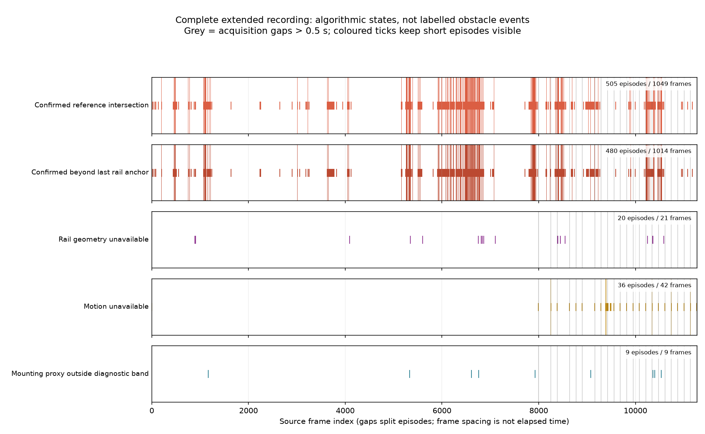
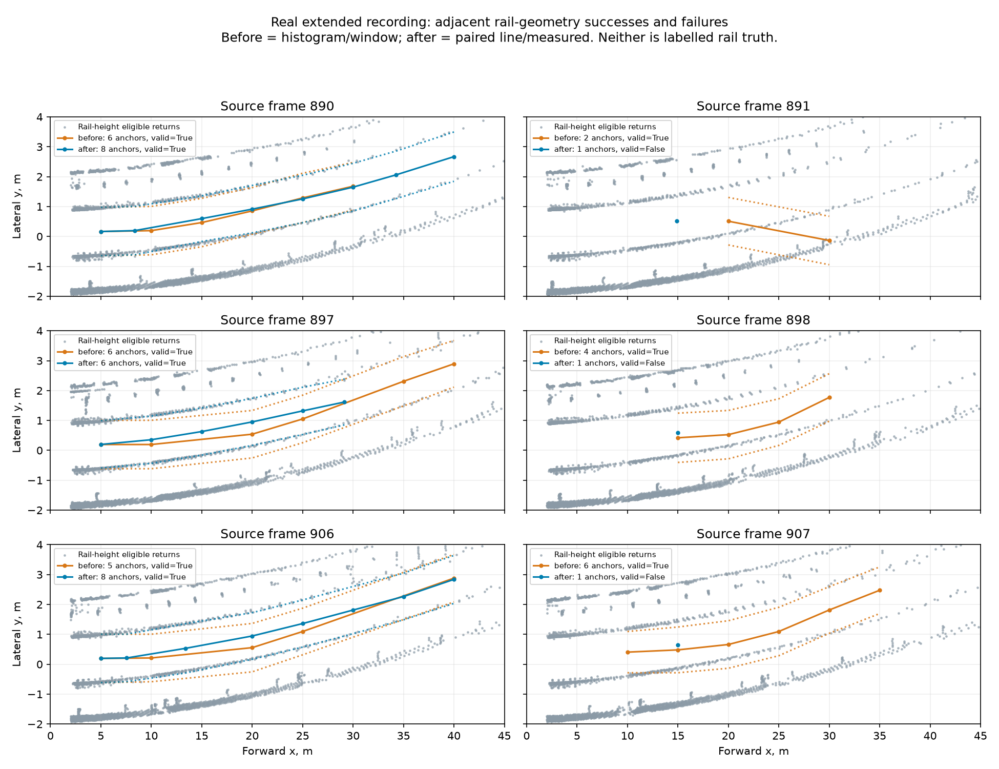
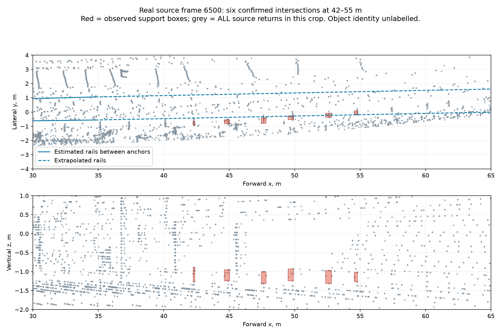

# Extended recording: continuous inference and review

## Scope

The recipe `configs/extended-full.json` processes the original recording in order, without restarting at its 221 storage-file boundaries. The detector/configuration is frozen from revision `60921a7`; review-tool changes in this iteration do not change detection. Acquisition gaps still reset temporal evidence. There are no obstacle labels for this recording, so alarm counts are not precision, recall, or independent obstacle counts.

The full run completed successfully under `build/extended-full`. The local directory contains the source/config snapshots, manifest, detections, and timing records. Large artifacts and source bags are intentionally excluded from Git.

## Complete result

All **11,271 source messages** were emitted and processed, with no duplicate or subsampled measurements. Recording duration is 1,199.8 s; runtime was 1,747.7 s (29.1 min). Peak process RSS was approximately 666 MiB.

| Metric | Result |
|---|---:|
| Supported geometry | 11,250 frames |
| Unavailable geometry | 21 frames in 20 episodes |
| Confirmed-intersection status | 1,049 frames in 505 episodes |
| Unresolved-object status | 10,189 frames |
| Candidate-only status | 12 frames |
| Registration rejected | 18 frames |
| First-frame motion unavailable, including resets | 24 frames |
| Acquisition gaps / applied resets | 23 / 23 |
| Recorded evidence violations | 0 |
| Median / p95 processing | 131.7 / 201.1 ms |
| Median / p95 offline iteration | 148.0 / 218.2 ms |

The full-run gaps match the independent raw-header audit **by frame and exact nanosecond-derived duration**. Saved object histories contain no duplicate/future timestamps or evidence preceding the most recent acquisition gap. This is metadata-based verification, not a complete proof of causal correctness.

There were 2,551 confirmed-intersection observations; **2,302 (90.2%)** belonged to clusters whose entire bounding box lay beyond the last accepted rail anchor. This does not prove those alarms false. It identifies extrapolated path geometry as a priority to investigate. 578,864 candidate observations were at least 60 m forward, including 85,619 at the configured minimum support count; these repeated observations do not establish field recall or independent object counts.

The observed mounting-height proxy has p05/p50/p95 **1.0831 / 1.0915 / 1.1011 m**. Nine individual frames fall outside the reference diagnostic band. The 1.075 m installation report's applicability and physical railhead identity remain unverified; no extrinsic transform was changed. Every frame remains `degraded` or `unavailable`, due at least to unverified sensor/extrinsic/timing provenance. No clear-route claim is made.

Timing is descriptive for this Mac, with occasional concurrent review/geometry work; it is not an isolated benchmark or target-hardware measurement, and remains slower than 10 Hz. The detector itself is unchanged in this iteration. Compared with the preceding 153-cloud sample, **coverage increases to the complete 11,271-cloud recording**. The earlier old/new detector comparison still covers only the fixed 153-cloud panel; a full old-detector baseline was not run.

Evidence: `results/extended-full-run-20260918.json` (episodes, review selection, hashes and summary), `results/extended-geometry-diagnosis-20260918.json` (bounded geometry experiment).



### Open review cases

- [Confirmed beyond measured rails: frames 6489–6510](http://127.0.0.1:8770/?frame=6500).
- [Another extended-intersection episode: frames 7871–7892](http://127.0.0.1:8770/?frame=7881).
- [Two consecutive geometry failures: frames 8543–8544](http://127.0.0.1:8770/?frame=8543).
- [Registration rejection: frames 9384–9387](http://127.0.0.1:8770/?frame=9385).

The final viewer index returned all 11,271 frames, including the last source frame 11270 with 189,594 decoded points. Optional diagnostic point arrays were not recorded. All three figures were rendered and visually inspected. `git diff --check` was run; automated tests were neither created nor run, per repository instructions.

## Review tools

```sh
.venv-iteration/bin/python -m tunnel_guard.run --experiment configs/extended-full.json
.venv-iteration/bin/python -m tunnel_guard.episode_report --run build/extended-full --bag new_data --output build/extended-full-episodes.json
.venv-iteration/bin/python -m tunnel_guard.review_viewer --run build/extended-full --bag data/extended_full/new_data --port 8770
```

The viewer now indexes complete JSONL rows by byte offset instead of keeping every object's history in RAM. `/metadata` discovers new complete rows during an ongoing run; reload the page to expose them in the slider. An unfinished final line is deferred. Replacement/truncation of the indexed file is rejected. Use `http://127.0.0.1:8770/?frame=891` to open a specific **source frame number**.

The display uses the actual recorded source cloud, saved corridor, candidate boxes, confirmation state, distance and data-quality information. This recipe did not save per-object diagnostic point arrays: clicking an object returns `diagnostics_not_recorded` for that extra view, rather than invented support points. The background display is downsampled, not the detector's input.

Executed HTTP checks on the running server retrieved real frames 0, 891, 1000 and 3000; the index grew as inference progressed. Frame 3000's object endpoint correctly reported missing optional diagnostics. The HTML with direct-frame navigation was served, but no browser interaction/JavaScript execution was verified in this iteration. The static geometry figure below was rendered and visually inspected.

`episode_report` streams saved rows, groups contiguous statuses/reasons, and **splits episodes at acquisition gaps**. It reports timestamp-list duplicates/future evidence, missing gap resets, support counts, mounting diagnostics and processing quantiles. These checks inspect saved metadata; they do not independently establish tracking correctness or ground truth. The older runner's combined alarm summary does not split gaps and answers a different question.

The report CLI was first run on the completed real segment-200 output: 51 frames, 50 with valid geometry, one acquisition gap with reset, zero recorded evidence violations, and 27 confirmed-intersection observations. These are observations, not 27 obstacles.

## Early geometry failures: actual source measurements

The first three failures are frames **891, 898 and 907**, each immediately preceded by valid geometry. The same exact full measurement was decoded again for each of these six frames; the normal geometry crop and voxel selection were applied. No analysis uses the viewer's reduced display cloud as detector input.

| Source frame | Histogram/window | Histogram/measured | Paired line/window | Paired line/measured |
|---|---:|---:|---:|---:|
| 890 | 6 anchors | 7 | 6 | 8 |
| 891 | 2 | 1 (invalid) | 2 | 1 (invalid) |
| 897 | 6 | 7 | 6 | 6 |
| 898 | 4 | 6 | 4 | 1 (invalid) |
| 906 | 5 | 8 | 5 | 8 |
| 907 | 6 | 5 | 7 | 1 (invalid) |

Two anchors are required. More anchors alone do not establish a correct physical track. For example, the old frame-891 path turns away from the visible rail-like lines and uses unbracketed anchors. Reverting to the old model would therefore hide uncertainty, not demonstrate a fix.



### Root-cause hypothesis and bounded experiment

In `TrackGeometry._rail_profile`, the next window's heading is zero until two anchors exist. A fitted first pair already has an observed heading, but this information is discarded. On frames 898/907 the fitted headings are approximately 0.0379/0.0458 (dy/dx); the next window nevertheless searches with zero heading. Its selected support falls behind the previous anchor and is rejected, leaving the model stuck at one anchor.

A local source variant under `build/extended-review/geometry-single-anchor-heading.py` carries that fitted heading into the next search while only one anchor exists. On the six explicitly selected development measurements it restores six anchors on frames 898 and 907, leaves 891 invalid, and changes the valid frame-897 path. This is **not promoted to production**: a wrongly selected first pair would also propagate its heading. It needs comparison across the full recording and the old fixed panel, including route identity, extrapolation and downstream candidates. The experiment did not alter thresholds or claim ground-truth improvement.

Detailed artifacts: `build/extended-review/early-geometry-ablation.json`, `early-geometry-trace.json`, `single-anchor-heading-experiment.json`, and the six `geometry-*.npz` actual geometry inputs. The variant/config hash and selection provenance are retained. No automated tests were created or run.

## Confirmed does not mean a labelled foreign obstacle

Source frame 6500 has six confirmed-intersection boxes at 42.24–54.55 m, each containing only 6–9 support voxels, with 2–3 recent intersection observations. Their vertical extents are about 0.25–0.37 m. These form a chain near the track level. The last accepted rail anchor is at 34.76 m; all six intersections rely on extrapolated track geometry.

The figure was regenerated from **all 3,611 valid source returns inside the shown crop**, not the reduced viewer background. It suggests a priority investigation of repeated infrastructure/rail-related support versus the extrapolated corridor. Neither appearance nor repeated confirmation establishes the physical identity of those objects; these are not six labelled obstacles or six proven false positives. Simply dropping small objects would also destroy recall of genuinely small hazards.



Actual local artifacts: `build/extended-review/frame-6500.json`, `source-roi-6500.npz`, `render-confirmed.py`. The original acquisition timestamp was matched before decoding the full source cloud. Candidate counts/boxes come from the continuous full detector run.

## Next decisions

1. Compare preservation of the first fitted rail heading across the complete recording and the original fixed panel before changing the default. Include wrong-pair propagation and downstream support/confirmation changes, not just geometry-valid counts.
2. Inspect repeated small confirmed support beyond the last rail anchor using source sequences. Separate sparse sampling of continuous infrastructure from separate obstacles; do not suppress small boxes merely because they look inconvenient.
3. Establish labels/provenance for a small set of independent events and checked empty intervals. Until then this corpus supports failure analysis and runtime measurements, not detection accuracy or a clear-route claim.

No new ML model or synthetic-data result is needed to explain the failures demonstrated here. Those approaches remain options if the geometric/observability limits and a suitable evaluation task are established.
