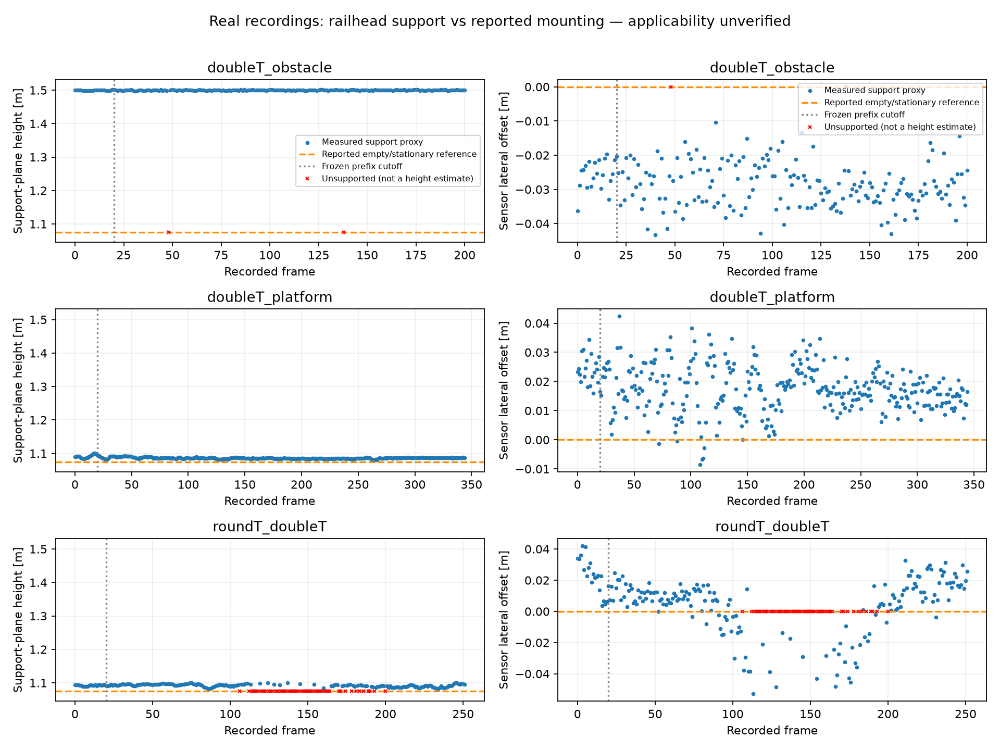

# Reported installation and measured rail support — 2026-09-17

## Decision

Record the user's 1.075 m railhead height and centered mounting as an **empty, stationary wagon reference**. The user does not know which recordings it applies to. No sensor transform is installed. Production detection keeps its existing geometry and degraded/unverified health; a separate diagnostic exposes the discrepancy without asserting sensor failure.

This iteration adds direct upper-return support observations, a chronological orientation experiment, and visible supporting points. It does not establish vehicle calibration, improved detection accuracy, or a clear route.

## Actual observations

All 798 real scans from the three already extracted recordings were processed. No additional dataset extraction or container was needed.

| Recording | Supported frames | Median plane-normal height | Height p05–p95 | Median lateral offset |
|---|---:|---:|---:|---:|
| doubleT_obstacle | 199 / 201 | 1.4999 m | 1.4984–1.5015 m | −0.0288 m |
| doubleT_platform | 345 / 345 | 1.0861 m | 1.0831–1.0912 m | +0.0174 m |
| roundT_doubleT | 196 / 252 | 1.0928 m | 1.0850–1.0981 m | +0.0084 m |

The obstacle recording differs from the reported height by about 425 mm. These are estimates from selected returns, not a surveyed installation measurement. The result could reflect a different mounting or incorrect rail interpretation; it must not be hidden by forcing a translation. Repeated frames are correlated, and percentile ranges are not confidence intervals.



## Method and scope

`tunnel_guard/mounting.py:observe_mounting` uses only the current processed scan. The existing bed and rail model seeds two narrow rail regions, 5–20 m forward. In each 1 m bin it selects the upper quartile of returns above the estimated bed, requires support on both sides, and fits a plane to paired representatives and a straight centerline to their midpoints. At least six paired bins spanning eight metres are required. Maximum plane/centerline residual is 0.08 m.

With unit plane normal `n`, sensor origin `s`, and a point `p` on the fitted track center, height is `n · (s − p)`. Forward, left and up form an orthonormal track-relative orientation. Reference height is used only after fitting, for comparison; it does not select returns or constrain the fit.

Important distinctions:

- Upper observed support can lie below the true running surface. This is a railhead **proxy**, not independently verified rail identity.
- Head-support separation is not gauge measured between inner rail faces.
- Plane-normal height is not necessarily gravity-vertical height; the reported direction and measurement tolerance are unknown.
- A local track frame does not determine the vehicle body frame, sensor-to-front distance, or swept envelope. Track curvature, cant and vehicle motion can change it.
- Existing bed selection still depends on configured plausible rail height. This observer is not an independent rail detector.

The 0.10 m height and 0.15 m lateral comparison bands are engineering diagnostics, not organizer tolerances or safety bounds. Recipes were developed on these recordings, so the experiment is not blind.

## Frozen orientation experiment

`tunnel_guard/mounting_report.py` freezes the mean orientation from the first 20 acquisitions per recording. Later timestamps must be strictly increasing and greater than the fitting cutoff. Numerical checks require 80% supported frames per partition, at most 1° orientation deviation, height span ≤0.10 m, lateral span ≤0.15 m, and no observed reference disagreement.

- Obstacle: fails reference-height agreement.
- Platform: passes these numerical checks, but applicability and physical extrinsics remain unverified.
- Round: fails later support fraction and orientation stability.

`tunnel_guard/mounting_replay.py` then reads original clouds strictly after the cutoff and rotates them about the sensor origin using the frozen candidate. It does not force a height or center translation. Source/config hashes, bag file identity, native binary identity and cutoffs are saved.

| Recording | Later frames | Supported before → after | Maximum orientation deviation before → after |
|---|---:|---:|---:|
| doubleT_obstacle | 181 | 179 → 181 | 0.254° → 0.133° |
| doubleT_platform | 325 | 325 → 325 | 0.459° → 0.475° |
| roundT_doubleT | 232 | 176 → 147 | 4.882° → 4.760° |

All **738** later acquisitions were processed. Round support gets worse (75.9% → 63.4%); the obstacle height conflict persists. The experiment does not justify a universal fixed rotation. Failed observations are retained. This replay evaluates geometry only, not detector accuracy after rotation.

## Preservation and runtime

Compared with `build/decode-real` (baseline commit `01c8d84`), all 798 acquisitions retain compared detection decisions, IDs, geometry and support fields: zero changed frames at the panel's 1e-10 numeric tolerance. Largest compared floating difference is 4.47e-13. All **44,291 candidate observations at ≥60 m** remain. No future or duplicate timestamps occur in the inspected evidence histories.

Observer median time is 1.70 / 2.91 / 1.92 ms for obstacle / platform / round. This is its instrumented duration, not a paired total-overhead benchmark. Total detector medians in this run are 149 / 116 / 137 ms; scheduling differences prohibit attributing changes versus baseline to an optimization.

## Visual inspection

The existing browser viewer displays actual selected support points in green, estimated height and lateral offset, reported height, and applicability limitations. **«Проверить установку»** zooms both projections to these points. This was visually inspected on actual obstacle frame 0.

RViz export adds a `railhead_support_for_mounting` POINTS marker and diagnostic text to existing cloud, corridor, candidate and confirmed-object messages. A fresh one-frame run per recording produced 50 / 79 / 98 support points; deserialized marker coordinates exactly match saved observations, and status messages contain the same mounting data. ROS2 runtime and RViz GUI were **not** run on this Mac.

## Reproduction

Run from repository root using the existing environment. Output directories must not already exist; choose new recipe outputs for another run. No automated tests were created or run.

```sh
.venv-iteration/bin/python -m tunnel_guard.run --experiment configs/mounting-prefix.json
.venv-iteration/bin/python -m tunnel_guard.run --experiment configs/mounting-real.json
.venv-iteration/bin/python -m tunnel_guard.panel_report --panel configs/mounting-panel.json --output build/mounting-comparison.json
MPLCONFIGDIR=/private/tmp/tg-matplotlib .venv-iteration/bin/python -m tunnel_guard.mounting_report --experiment configs/mounting-report.json
.venv-iteration/bin/python -m tunnel_guard.mounting_replay --experiment configs/mounting-corrected-prefix.json
.venv-iteration/bin/python -m tunnel_guard.mounting_replay --experiment configs/mounting-corrected-real.json
.venv-iteration/bin/python -m tunnel_guard.run --experiment configs/mounting-visual-prefix.json
.venv-iteration/bin/python -m tunnel_guard.review_viewer --run build/mounting-real --bag data/sourcecraft_subset/for_hackathon/doubleT_obstacle --port 8768
git diff --check
```

Compact evidence is versioned in `results/mounting-reference-20260917.json`; complete per-frame outputs, sources and manifests remain under `build/mounting-*` locally. Baseline `build/decode-real` is needed for the comparison recipe.

## Next priorities

1. On extended data, record installation identity, load/stationarity and raw timing. Keep 1.075 m applicability unknown until linked to a recording.
2. Independently verify paired rail support and develop a curved/canted local track model where fixed straight-track orientation fails. Do not treat the successful platform consistency check as physical calibration.
3. Obtain sensor-to-vehicle front/body geometry and verify time/deskew before claims about collision clearance or live warning distance.
4. Evaluate independent obstacle events and negative intervals with coverage labels; current sparse/nonexhaustive labels cannot establish precision or safe detection range. ML or synthetic augmentation does not resolve missing physical references.
