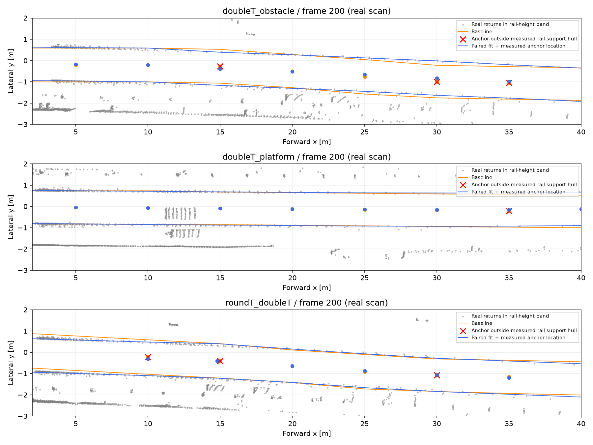

# Rail geometry correction — 2026-09-17

## Delivered behavior

The default Python and native detector recipes now use `paired_line` rail centers and `measured` anchor locations. This changes the detector's path geometry and classification, not only diagnostics. The existing viewer and RViz export consume that geometry directly. Installation extrinsics remain unverified; the 1.075 m reference is not imposed on recordings.

Baseline: commit `36de7b4`, `build/mounting-real`, recipe preserved as `configs/detector-rail-baseline.json`. Selected new run: `build/rail-measured-real`, 798 real acquisitions. No automated tests or synthetic clouds were used.

## Problems and implementation

In `TrackGeometry._rail_profile`, a histogram pooled over a long window was treated as a measurement at the window center. Early windows used zero heading, so oblique rails and asymmetric longitudinal sampling biased that estimate. A second problem was accepting an anchor whose nominal x lay outside the longitudinal extent of one or both measured rails. This reset extrapolation uncertainty at an unmeasured location.

`refine_rail_pair` fits a common local heading, center and separation using longitudinal-bin representatives from both rail strips. It uses existing span, heading, separation and strip-width limits, with two fitting/selection passes. Unsupported fits retain the histogram proposal. It is a local straight-line refinement, not a general curved-track estimator.

The selected `measured` policy places each anchor inside the intersection of both sides' measured longitudinal extents. Moving the anchor updates its lateral coordinate along the fitted heading. Non-overlapping supports or non-increasing anchors are rejected. The path remains piecewise linear, and the existing extrapolation uncertainty now starts from the actual anchor location. Per-anchor support ranges and relocation are recorded in `geometry.rail_support_diagnostics`.

A strict alternative that simply rejected window centers outside support was run and rejected: it made 62 roundT frames unavailable. Keeping a valid observed pair at its measured location resolves that failure. Both failed and intermediate recipes/results are retained for comparison.

Also fixed `evaluate.main`: runner `*-timing.jsonl` telemetry was being mistaken for prediction records, causing `KeyError: bag`. The evaluator now skips that named telemetry stream. Both baseline and new real evaluations completed after this fix.

## Geometric evidence

Nine existing real diagnostic clouds (frames 0, 100, 200 from each recording) were partitioned into alternating 0.30 m longitudinal bins. Both models fit the same even bins; residuals were evaluated on withheld odd bins, on a shared union of plausible rail support. Median lateral residual improves on **8/9** clouds. One roundT frame slightly worsens: 30.84 → 31.24 mm. RoundT frame 200 improves from 112.16 → 60.28 mm on this shared selection.

This is not independent rail ground truth: selection still uses the fitted paths and baseline bed, and these are development recordings. Different candidate recipes can change the shared selection; their residual tables must not be treated as a single identical point panel across experiments.

On the complete selected run:

- All **798/798** frames have valid geometry.
- **6093/6093** recorded anchors lie within both sides' measured longitudinal hulls.
- **392** anchors moved from their arbitrary window centers.
- No sensor rotation/translation, point range limits, weak-support thresholds, or temporal confirmation thresholds were changed.



The figure independently reconstructs both geometries from the saved real geometry cloud. Red crosses show baseline anchors outside measured longitudinal support. Gray points are real returns in the plausible rail-height band, not verified rail labels.

## Detector changes and limitations

| Recording | Frames | Confirmed intersection observations before → after | Frames with obstacle status before → after | Far candidate observations ≥60 m before → after |
|---|---:|---:|---:|---:|
| doubleT_obstacle | 201 | 203 → 176 | 119 → 158 | 10665 → 13092 |
| doubleT_platform | 345 | 255 → 231 | 87 → 66 | 22191 → 21893 |
| roundT_doubleT | 252 | 191 → 82 | 64 → 44 | 11435 → 10943 |

Intersection observations count objects per frame; obstacle-status counts count frames. One can decrease while the other increases. These changes are **not measured false-alarm reduction**. No exhaustive labels exist for these panels.

All five provisional observations of one upright structure still match at IoU ≥0.25, with mean IoU 0.28254 → 0.28380 and unchanged distance error. They are not five independent obstacle events or human-verified collision labels.

Pre/post-voxel return counts in every range bin match the baseline on all frames. This confirms no reduction in input coverage; it does **not** prove identical candidate membership. At bbox IoU ≥0.5, only 7700/10665, 12797/22191 and 7974/11435 baseline far observations match a new box. Thin/zero-volume boxes and regrouping affect IoU, but unmatched observations remain an unresolved regression-review item. Complete unmatched examples are retained locally in `build/rail-measured-retention.json`; compact examples and its hash are versioned. Do not claim preservation of field recall from aggregate counts.

No future or duplicate timestamps were found in saved confirmation histories. Geometry uses only the current acquisition. Median detector time was 151 / 122 / 138 ms, compared with 149 / 116 / 137 ms in the earlier run. These sequential measurements are descriptive, not a paired speed benchmark or evidence of 10 Hz throughput.

The new recipe is the development default because it fixes the geometric meaning of an anchor and improves the measured support fit. It is **not accepted for a safety deployment**; the frozen baseline recipe remains available for regression review.

## Visual and integration verification

The actual roundT frame 200 was opened in the existing browser viewer: cloud, corrected reference corridor, unresolved candidates, distance and degraded quality are visible. New viewer: `http://127.0.0.1:8769/`. This is recorded replay, not a live sensor.

After selecting the default recipes, an additional nine real frames were processed with RViz export. All nine saved clouds and marker arrays were deserialized and contain the corrected corridor. ROS2 runtime/RViz GUI were not launched on this Mac.

## Executed commands

All commands use `.venv-iteration/bin/python`; output directories must be new when repeating experiments. Existing source recordings and baseline outputs are required.

```sh
python -m tunnel_guard.run --experiment configs/rail-line-prefix.json
python -m tunnel_guard.run --experiment configs/rail-line-real.json
python -m tunnel_guard.rail_fit_report --experiment configs/rail-fit-report.json
python -m tunnel_guard.run --experiment configs/rail-supported-prefix.json
python -m tunnel_guard.run --experiment configs/rail-supported-real.json
python -m tunnel_guard.rail_fit_report --experiment configs/rail-supported-fit-report.json
python -m tunnel_guard.run --experiment configs/rail-measured-prefix.json
python -m tunnel_guard.run --experiment configs/rail-measured-real.json
python -m tunnel_guard.rail_fit_report --experiment configs/rail-measured-fit-report.json
python -m tunnel_guard.panel_report --panel configs/rail-line-panel.json --output build/rail-line-comparison.json
python -m tunnel_guard.panel_report --panel configs/rail-supported-panel.json --output build/rail-supported-comparison.json
python -m tunnel_guard.panel_report --panel configs/rail-measured-panel.json --output build/rail-measured-comparison.json
python -m tunnel_guard.evaluate --run build/mounting-real --annotations annotations/sourcecraft-provisional.json --output build/rail-baseline-provisional.json
python -m tunnel_guard.evaluate --run build/rail-line-real --annotations annotations/sourcecraft-provisional.json --output build/rail-line-provisional.json
python -m tunnel_guard.evaluate --run build/rail-measured-real --annotations annotations/sourcecraft-provisional.json --output build/rail-measured-provisional.json
python -m tunnel_guard.run --experiment configs/rail-integrated-prefix.json
python -m tunnel_guard.review_viewer --run build/rail-measured-real --bag data/sourcecraft_subset/for_hackathon/roundT_doubleT --port 8769
git diff --check
```

Per-frame diagnostics, source snapshots, manifests, failures and timings are under the corresponding `build/rail-*` directories. Compact evidence: `results/rail-geometry-20260917.json`. Plot reconstruction script is retained with the measured run; its baseline input must be `configs/detector-rail-baseline.json` after promotion of defaults.

## Next priorities

1. Inspect candidate membership changes at far range using support-point overlap and independent event labels; box IoU alone is insufficient for sparse planar returns.
2. Separate object formation from uncertain corridor geometry so small changes in rail height/position do not regroup long infrastructure components unpredictably.
3. Replace the heuristic uncertainty with locally measured fit/spread and curvature evidence; longitudinal hull containment does not prove dense support across internal gaps.
4. Use extended recordings to evaluate rail identity, switches, cant and actual obstacle events. Confirm per-recording installation, body/front offset and timing before physical clearance claims.
