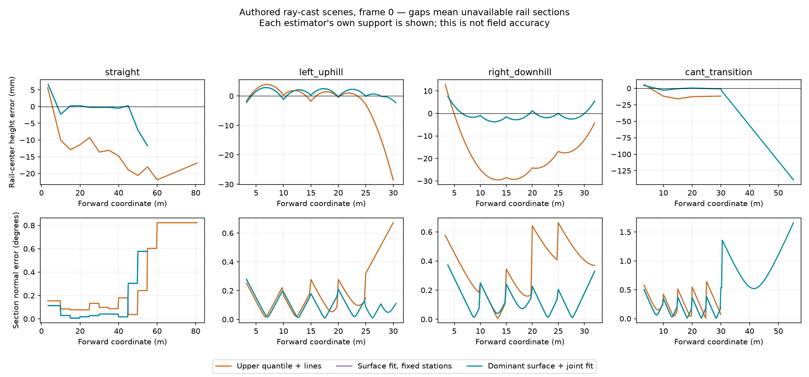

# Головки рельсов и 3D-габарит: эксперимент 2026-09-19

## Задача и исходное состояние

Базовый вариант — `detector-local3d-experimental.json`, результаты
`build/track-local3d-final-real-supported`. Он строит секции по двум рельсам,
но оценивает высоту отдельными прямыми по 80-му процентилю в продольных бинах.
В полосах смешиваются верхняя и боковая поверхности; изгиб по высоте и изменение
поперечного наклона не описываются двумя независимыми прямыми.

Новые методы включаются только отдельными конфигами. Основные detector.json и
detector-native.json не изменены. Ветка Герасимова с незакрытыми замечаниями не слита.

## Что прочитано и применено

- [Kononen et al., 2024, Fully automated extraction of railtop centerline](https://doi.org/10.1016/j.autcon.2024.105812),
  [полный текст авторской копии](https://acris.aalto.fi/ws/portalfiles/portal/162129059/1-s2.0-S092658052400548X-main.pdf).
  Прочитаны методы 3.2.3–3.2.6 и условия получения данных. Авторы разделяют поиск
  пары и уточнение головки по локальному профилю исходных точек. Отдельно учитывают,
  что вдали видна только боковая часть. У них геопривязанное MLS с IMU/GNSS и
  заданными размерами профиля; их точность нельзя переносить на наши одиночные сканы.
- [Niina et al., 2018](https://doi.org/10.5194/isprs-archives-XLII-2-767-2018): повторно
  прочитаны разделы локальных сечений и fitting головки через ICP в сохранённом PDF.
  Метод использует профиль головки для оценки положения и поперечного уровня.
  Нормативные расширения и геометрию чужого подвижного состава не переносили.

Применён принцип «сначала пара, затем поверхность в локальной системе». Ни одна
статья полностью не воспроизведена; авторский код не заимствован. Совместный
устойчивый fit и выбор плотной полосы ниже — собственные проверяемые гипотезы.
Дополнительных зависимостей, GPU, контейнеров или весов не скачивалось.

## Реализовано

`TrackGeometry._fit_joint_head_heights` использует модель
`z = h + grade*t + curvature*t² + side*(crosslevel + twist*t)`.
Оба рельса оцениваются совместно. Продольные бины и стороны имеют сбалансированные
веса; Huber IRLS подавляет одиночные выбросы. Модель оценивает координаты в системе
лидара, не абсолютный уклон относительно силы тяжести.

Три явных варианта конфигурации:

1. `detector-head-joint-experimental.json`: только совместный устойчивый fit.
   Не принят: смешение поверхности и боковины остаётся, на уклонах бывают ухудшения.
2. `detector-head-surface-experimental.json`: после удаления продольного тренда
   выбирается наиболее плотная полоса остаточной высоты на каждой стороне.
   Полная ширина полосы 10 мм — экспериментальная гипотеза, не калибровка шума Hesai.
   После выбора обе поверхности повторно аппроксимируются совместно.
3. `detector-head-supported-experimental.json`: дополнительно размещает сечение
   внутри общего измеренного диапазона обеих выбранных поверхностей. Полином
   оценивается в новой координате, боковой центр переносится по fitted heading.
   При отсутствии общей опоры сечение не строится. Секции с обратным порядком
   координат не соединяются. Пороги минимального span, числа бинов и уклона не ослаблены.

В diagnostic записываются причина отказа, исходная/полученная координата сечения,
диапазоны выбранных поверхностей и число точек. Крайние секции viewer/RViz
продолжаются только до общей опоры выбранных поверхностей, а не всей исходной полосы.
Точки, не выбранные для fit, **не удаляются из облака детектора**.

`assess_track_scenes` теперь корректно сравнивает несколько local_3d вариантов:
общие станции, отдельная протяжённость опоры и ошибки на собственной опоре каждого.
Последнее важно: иначе сужение зоны работы искусственно улучшает сравнение.
`plot_head_surface` строит сохранённый график ошибок и разрывов без интерполяции
через отсутствующие секции.

## Что это ещё не решает

Плотная поверхность может оказаться боковиной или другой конструкцией. Без
проверенного профиля и устойчивой идентификации двух рельсов мы не называем её
доказанной поверхностью катания. Не реализован глобальный выбор цепочки пар.
Наблюдаемые hull-интервалы не доказывают отсутствие внутренних пропусков отражений.
Ошибка fit и установленный floor остаются эвристической оценкой, а не вероятностной
гарантией. Эталонный контур не является swept envelope длинного вагона с выносами.

Автоматические тесты не создавались и не запускались. Проверки — реальные CLI,
настроенные ray-cast эксперименты и отдельное чтение/оценка их результатов.

## Синтетика: улучшение и обнаруженная граница метода

Итоговый `head-supported-scenes`: 13 сцен × 6 кадров × 3 варианта детектора.
Это **78 общих облаков и 234 вызова детектора**, а не 234 независимых сцены.
Прямая, поворот с подъёмом, поворот со спуском, изменение поперечного наклона;
для них также пустые и соседние объекты, плюс объект на 3 м.
Источник — Open3D ray casting с прежними seed/лучами/шумом. Это не реальные проезды.

Общие станции, поддержанные всеми тремя сравниваемыми вариантами:

| Сцена | Медианная ошибка высоты старый→новый, мм | Ошибка нормали, градусы |
|---|---:|---:|
| Прямая | 11.56→0.25 | 0.113→0.025 |
| Поворот с подъёмом | 1.34→2.32 | 0.080→0.031 |
| Поворот со спуском | 21.01→2.63 | 0.372→0.057 |
| Изменение поперечного наклона | 12.48→0.69 | 0.235→0.094 |

На подъёме высота немного ухудшилась. Четыре объекта на 20 м остались подтверждены
во всех 24 кадрах; на 3 м — 5/6, первый кадр по-прежнему unresolved.
Это diagnostic visible-support IoU ≥0.1, не независимая полевая recall.

**Средних недостаточно.** На прямой медианная суммарная длина секций уменьшилась
с 77.8 до 49.3 м. На изменении поперечного наклона перенос опор увеличил её
с 26.9 до 58.5 м, но на дальней добавленной части fit выбрал неверную поверхность:
ошибка высоты достигает 98.7 мм в проверенных серединах секций и около 140 мм
у дальнего конца в показанном кадре. Правильное положение станции не доказывает,
что выбранная поверхность принадлежит верху головки. Этот отказ сохранён,
его не маскируем ограничением графика или зоной общих станций.



Промежуточный вариант без переноса станций и неудачный joint-only сохранены в
`head-surface-scenes`, `head-joint-prefix`, `head-surface-prefix`; их исходники
сняты на момент запуска. На пустых уклонах неопределённые тревоги остались.

## Решение по включению

**Не включать в основной детектор.** Есть воспроизводимое улучшение высоты и
ориентации на общей видимой опоре, но дальняя идентификация поверхности ещё неверна.
Новый конфиг нужен для дальнейшего исследования и визуального разбора реальных
проездов; он не является утверждением, что проблема габарита уже решена.

Следующая приоритетная работа — совместный выбор последовательности пар **и**
поверхностей, с отдельными гипотезами верх/боковина и проверкой профиля. Протягивать
одну наиболее плотную полосу недостаточно. ML для этого шага пока не требуется.

## Реальная панель и сохранение измерений

Итоговый вариант выполнен на **951 кадре шести записей**, без пропусков и
расхождений measurement ID относительно сохранённого local_3d baseline.

| Показатель | До | После |
|---|---:|---:|
| Базовая геометрия valid (не гарантия 3D-покрытия) | 950 | 950 |
| Кадры без локальных 3D-секций | 10 | 3 |
| Подтверждённые наблюдения пересечения | 4 | 4 |
| Наблюдения кандидатов с cluster_min_x ≥60 м | 53829 | 53888 |
| Истории с будущими / повторёнными измерениями | 0 / 0 | 0 / 0 |

В roundT_doubleT восстановлена опора в восьми кадрах, новый отказ — кадр 170.
Медианная суммарная длина секций там выросла 27.81→34.65 м. Это **доступность**
геометрии, не независимое подтверждение правильности. В new_data_0 и new_data_100
медианная длина уменьшилась, 43.52→42.08 и 39.22→36.21 м соответственно.
В doubleT_obstacle длина практически прежняя, 40.34→40.31 м.

Числа входных отражений до и после geometry voxel одинаковы во всех диапазонах
всех 951 кадров. Это подтверждает отсутствие новой фильтрации облака, но не
доказывает сохранение каждого опасного объекта: группировка кандидатов меняется.
На прежней provisional разметке пяти кадров одного объекта — 5/5 совпадений,
средний IoU 0.28955 против 0.28995, distance MAE прежняя, 0.201 м. Precision
не оценивается: разметка неисчерпывающая и не является независимым ground truth.

Промежуточный fixed-station вариант также прошёл все 951 кадров и сохранён:
он терял всю опору дополнительно в 17 кадрах, восстанавливал в шести. Отдельный
147-кадровый replay с диагностикой показал причину — выбранная полоса поверхности
не покрывала прежнюю станцию. Добавление диагностических полей не изменило
rail_frames или статусы ни на одном из этих 147 кадров.

## Запуски, артефакты и визуализация

Основные выполненные команды, Python из `.venv-iteration/bin/python`:

```sh
python -m tunnel_guard.track_scene_experiment --experiment configs/head-joint-prefix.json
python -m tunnel_guard.track_scene_experiment --experiment configs/head-surface-prefix.json
python -m tunnel_guard.track_scene_experiment --experiment configs/head-surface-scenes.json
python -m tunnel_guard.run --experiment configs/head-surface-real-prefix.json
python -m tunnel_guard.run --experiment configs/head-surface-real.json
python -m tunnel_guard.run --experiment configs/head-surface-diagnosis.json
python -m tunnel_guard.track_scene_experiment --experiment configs/head-supported-prefix.json
python -m tunnel_guard.run --experiment configs/head-supported-diagnosis.json
python -m tunnel_guard.track_scene_experiment --experiment configs/head-supported-scenes.json
python -m tunnel_guard.run --experiment configs/head-supported-real.json
python -m tunnel_guard.run --experiment configs/head-supported-real-prefix.json
python -m tunnel_guard.panel_report --panel configs/head-supported-comparison.json --output build/head-supported-real/comparison.json
python -m tunnel_guard.evaluate --run build/head-supported-real --annotations annotations/sourcecraft-provisional.json --output build/head-supported-real/evaluation.json
python -m tunnel_guard.assess_track_scenes --run build/head-supported-scenes --output build/head-supported-scenes/assessment.json
python -m tunnel_guard.plot_head_surface --run build/head-supported-scenes --output docs/figures/head-supported-20260919.png
python -m tunnel_guard.review_viewer --run build/head-supported-real --bag data/sourcecraft_subset/for_hackathon/roundT_doubleT --port 8772
```

Также выполнены panel_report/evaluate для промежуточного surface-варианта и
assess_track_scenes для префиксов и полного surface-прогона. Все перечисленные
CLI завершились с кодом 0. Повтор требует нового output в копии recipe: результаты
не перезаписываются. Подготовленный head-joint-scenes отдельно не запускался —
joint-вариант вошёл в полный head-surface-scenes.

Метрики и provenance: `results/head-surface-20260919.json`; полные JSONL и снимки
кода/config — в соответствующих build/head-* каталогах. Seed и общие hash облаков
сохранены. Тайминги этих прогонов не являются сравнительным benchmark: часть
запусков выполнялась одновременно. Графики просмотрены как изображения.

Новый viewer — **http://127.0.0.1:8772**, все 252 кадра roundT_doubleT; старый
8771 не переключался. Проверена HTTP-загрузка последнего кадра. RViz bag префиксы
созданы через общий renderer. GUI RViz/браузера в этой итерации не проверялся.
