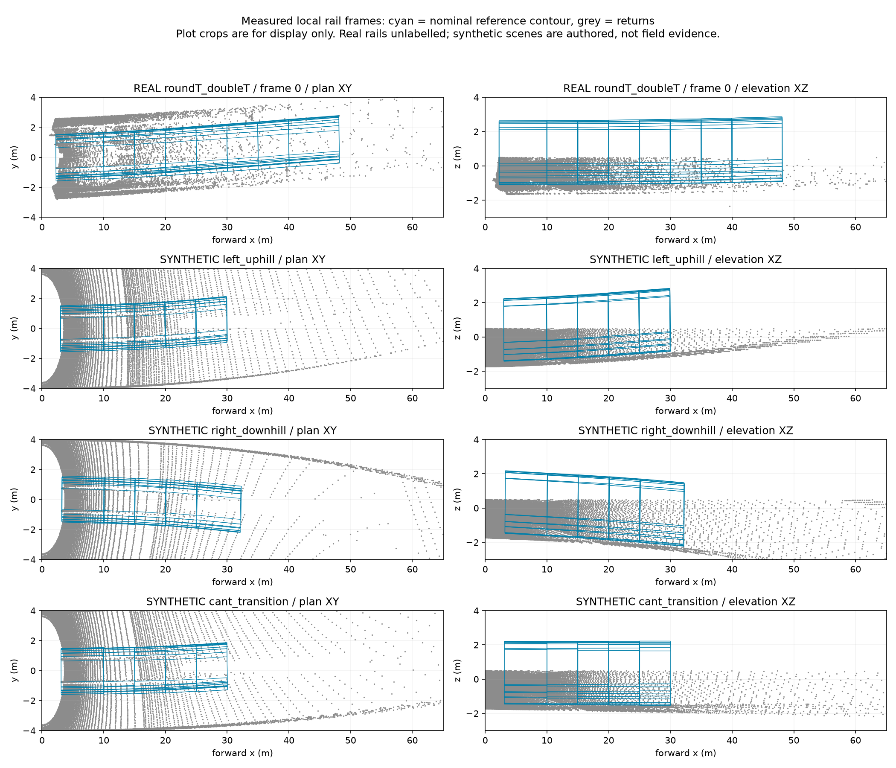

# Применение геометрического ресерча: непрерывность и локальный 3D-габарит

2026-09-18. Исходный commit: `da74738`. [Обоснование по литературе](TRACK_GEOMETRY_LITERATURE_20260918.md). Это собственная адаптация геометрических принципов, не воспроизведение опубликованного метода или его метрик.

## Что интегрировано

**Основной режим:** `configs/detector.json` и `configs/detector.json` теперь включают `rail_pair_continuity: relocated`. После уточнения и переноса опоры проверяется фактический наклон от предыдущей опоры: `abs(delta_y) <= rail_max_heading * delta_x`. Старый допуск в центре поискового окна больше не позволяет принять противоречащий конфигу переход. Отклонённые предложения сохраняются в `geometry.rail_rejections`. Предел направления не менялся.

**Исторический эксперимент (не поддерживается текущим детектором):** режим `local_3d` был удалён 2026-09-22, поскольку классификатор существовал только на Python-пути. Ниже приведены его старые результаты; команды с удалёнными рецептами больше не запускаются.

- `geometry._fit_head_heights`: независимые локальные оценки высоты двух рельсовых полос, с балансировкой продольных бинов, проверкой поддержки, уклона и остатка. Верхний квантиль отражений — приближение поверхности головки, не доказательство правильного выделения её верхней грани.
- `frame_segments`: центр, касательная, ортогонализованная поперечная ось и нормаль. Неудачная оценка головок разрывает поддержку. На крайних участках продолжение допускается только внутри пересечения измеренных продольных диапазонов обеих сторон.
- `rail_coordinates`/`classify`: координаты точки относительно ближайшего поддержанного участка; заданный контур проверяется в местном базисе. Ошибка высоты головок входит в эвристический запас по высоте и наклону. Полной вероятностной модели калибровки нет.
- `accelerator.classify_geometry`: для нового режима явно используется NumPy-путь. Старое C++-ядро не получает неподдерживаемую геометрию; остальное ускорение сохраняется. Портировать проекцию в C++ следует после стабилизации оценки и профилирования.
- `visualization.corridor_edges`: viewer и RViz используют тот же базис. Геометрия сериализуется с `rail_frame_version=2`; старые записи без этой версии сохраняют прежние границы сечений.
- В качестве данных отмечается `experimental_local_rail_frames`; отсутствие локальных сечений отражается отдельной причиной качества и не выдаётся за свободный путь.

Начальный fitted heading из предыдущей итерации не включён. Многогипотезный выбор рельсов и полноценная модель движения вагона не реализованы в этой итерации. Исправление непрерывности отвергает недопустимую лучшую пару; оно ещё не ищет лучшую альтернативную последовательность.

## Реальная запись и решение о включении

### Полная геометрия: 11271 кадров

`build/track-continuity-full-geometry`, сравнение с неизменённым `build/extended-full`.

| Показатель | До | Контроль непрерывности |
|---|---:|---:|
| Кадры с переходом выше заданного предела направления | 201 | 0 |
| Доступная геометрия | 11250 | 11248 |
| Недоступная геометрия | 21 | 23 |
| Принятые опоры вне диапазона обеих сторон | — | 0 |

208 предложений отклонено. Новые неизвестные кадры: **8489 и 8555**. Прежние пары давали наклоны около 0.140 и 0.221 при установленном пределе 0.12. Их отклонение — осознанная потеря доступности вместо принятия противоречащей конфигу модели, а не рост точности по независимой разметке.

В 199 кадрах изменился центр пути на общих пробных дистанциях; медиана и p95 изменения по всей записи равны нулю, максимум 6.729 м. Большое изменение не объявляется автоматически исправлением ошибки: истинная пара в этих кадрах независимо не размечена. Выбранная политика включена в основные рецепты потому, что обеспечивает согласованность с явным пределом конфигурации.

Это **геометрический replay**, не повтор полного детектора на всех 11271 кадрах и не полная оценка local_3d на этой записи.

### Полный детектор: фиксированная панель из 951 кадра

Три исходных bags (798) и три fixed-сегмента extended (153). Baseline: `build/rail-measured-real` и `build/extended-measured`.

| Показатель | Baseline | Непрерывность | Итоговый local_3d |
|---|---:|---:|---:|
| Кадры | 951 | 951 | 951 |
| Доступная базовая геометрия | 950 | 950 | 950 |
| Наблюдения подтверждённого пересечения | 524 | 520 | 4 |
| Наблюдения кандидатов ≥60 м | 54116 | 54270 | 53829 |
| Истории с будущими / повторными timestamps | 0 / 0 | 0 / 0 | 0 / 0 |

`valid` здесь означает доступность базовой геометрии, а не покрытие всей дистанции локальными сечениями. Резкое уменьшение подтверждений local_3d нельзя считать улучшением precision: изменились координаты, поддержка и зона неопределённости. Дальние кандидаты остаются, но агрегатный счётчик не доказывает сохранение каждого объекта; 287 наблюдений меньше baseline остаются ограничением анализа.

Все пять provisional-боксов одной структуры совпали в local_3d при IoU≥0.25; среднее IoU=0.289953. Это не независимый полевой recall. Изменения числа входных отражений по дальностям отдельно проверяются в машиночитаемом отчёте. Калибровка, пределы range и входная вокселизация не менялись. Времена конкурентных прогонов не являются доказательством ускорения.

После включения основной конфигурации повторены 51 реальный кадр: объекты, статусы, расстояния, позы и численные оценки геометрии совпали с отдельным прогоном continuity. Различаются только добавленные поля описания формата геометрии. До включения также проверен старый рецепт на 51 кадре; его решения сохранились. В обеих 951-кадровых панелях число входных отражений до и после геометрической вокселизации совпало с baseline во всех дальностных диапазонах.

## Эксперименты с известной геометрией

Новый `track_scene_experiment` строит поверхности рельсов и тоннеля по заданным горизонтальной/вертикальной кривизне, уклону и меняющемуся поперечному наклону. Open3D выполняет трассировку лучей с закрытием дальних поверхностей ближними. Это не деформация уже готового облака. Все варианты получают один и тот же массив измерений; сохраняются seed, параметры, хеш облаков, исходники и результаты.

Прогоны итоговой версии: 4 положительные сцены, 8 пустых/боковых и одна ближняя; 6 кадров в каждой × 3 варианта = **234 вызова детектора на 78 синтетических облаках**. Сенсор неподвижен, шум и пропуски независимы между кадрами. Материалы, multipath, rolling scan и реальная калибровка не моделируются.

- Объект на 20 м: 24/24 совпадения подтверждённого пересечения у всех вариантов при диагностическом IoU≥0.1.
- Объект на 3 м: baseline/continuity 6/6, local_3d **5/6**. Первый кадр остаётся неопределённым; провал не исключён из результата.
- Пустой подъём: baseline подтверждает ложное пересечение в 5/6 кадрах; local_3d вместо этого даёт неопределённую тревогу в 5/6. Пустой спуск: baseline 3 подтверждённых + 2 неопределённых; local_3d 5 неопределённых. **Лишние тревоги не устранены.** На прямой и сцене изменения поперечного наклона без объекта тревог нет в этих шести кадрах.
- Боковой объект на 2.4 м не получает совпадающего подтверждённого пересечения; возможны тревоги от других частей сцены. Неполный recall боковых кандидатов здесь не скрывается за метрикой габарита.

Исторический `assess_track_scenes` анализировал только середины поддержанных участков; утилита удалена вместе с Python-only локальной геометрией.

| Сцена | Медиана угловой ошибки нормали: baseline → local_3d | Медиана ошибки высоты: baseline → local_3d |
|---|---:|---:|
| Прямая | 0.021° → 0.145° | 0.32 → 13.29 мм |
| Поворот + подъём | 0.408° → 0.095° | 16.01 → 2.07 мм |
| Поворот + спуск | 0.501° → 0.372° | 7.82 → 21.01 мм |
| Меняющийся поперечный наклон | 0.775° → 0.237° | 8.62 → 12.53 мм |

Ориентация улучшилась на трёх непрямых сценах, но высота ухудшилась на трёх из четырёх. Поэтому **local_3d не выбран основным режимом**. Это наблюдаемые недостатки оценки головок и поддержки, не повод менять пороги после просмотра результатов.

## Визуализация



Viewer: `http://127.0.0.1:8771`, реальная `roundT_doubleT`, первые три кадра, итоговый local_3d. Проверен HTTP payload: исходное измерение, облако, контур, состояние качества. Из шести RViz-записей прочитаны и десериализованы все 54 сообщения (18 облаков, 18 MarkerArray, 18 status). Это не проверка GUI RViz. Standalone-рисунок просмотрен; интерактивный browser GUI в этом запуске не инспектировался.

## Воспроизведение

Команды выполнены через `.venv-iteration/bin/python`. При повторе нужен новый output в копии рецепта: результаты не перезаписываются. Open3D уже был зависимостью проекта; новые контейнеры, веса и датасеты не скачивались.

```bash
(historical command; recipe removed)
python -m tunnel_guard.rail_geometry_audit --experiment configs/track-continuity-full-geometry.json
python -m tunnel_guard.run --experiment configs/track-continuity-real.json
(historical command; recipe removed)
python -m tunnel_guard.panel_report --panel configs/track-continuity-comparison.json --output build/track-continuity-real/comparison.json
python -m tunnel_guard.panel_report --panel configs/track-local3d-comparison.json --output build/track-local3d-final-real-supported/comparison.json
python -m tunnel_guard.evaluate --run build/track-local3d-final-real-supported --annotations annotations/sourcecraft-provisional.json --output build/track-local3d-final-real-supported/evaluation.json
python -m tunnel_guard.track_scene_experiment --experiment configs/track-curves-prefix.json
python -m tunnel_guard.track_scene_experiment --experiment configs/track-curves-scenes.json
python -m tunnel_guard.track_scene_experiment --experiment configs/track-curves-negative-scenes.json
python -m tunnel_guard.track_scene_experiment --experiment configs/track-near-scene.json
(historical assessment command; utility removed)
python -m tunnel_guard.plot_track_geometry --scenes build/track-curves-scenes-supported --real build/track-local3d-final-prefix-supported-v2 --bag data/sourcecraft_subset/for_hackathon/roundT_doubleT --output docs/figures/track-local3d-20260918.png
python -m tunnel_guard.review_viewer --run build/track-local3d-final-prefix-supported-v2 --bag data/sourcecraft_subset/for_hackathon/roundT_doubleT --port 8771
python -m tunnel_guard.run --experiment configs/track-default-preserved.json
python -m tunnel_guard.run --experiment configs/track-default-promoted.json
```

Исторический `detector-track-baseline.json` замораживал старый native-рецепт до включения непрерывности. Сценарии теперь явно ссылаются на него; исходные snapshots предыдущих запусков не менялись. Промежуточные версии сохранены в `build/track-local3d-real`, `build/track-local3d-final-real`, `build/track-curves-scenes`, `build/track-curves-negative-scenes`. Итоговые каталоги имеют суффикс `supported`; несколько коротких префиксов отражают проверку версии сериализованной геометрии.

Автоматизированные тесты не создавались и не запускались. Полный 11271-кадровый replay local_3d **не выполнялся**; режим впоследствии удалён. Отчёт: `results/track-local3d-20260918.json`.

## Следующий приоритет

1. Устранить смещение оценки поверхности головок: нынешний верхний квантиль чувствителен к дискретизации и смешению поверхности/боковой грани. Независимо оценивать высоту и наклон, не подгонять общий offset к увиденной синтетике.
2. Совместно выбирать последовательность пар и согласовывать её с локальным профилем основания. Ограничение наклона не исключает неверную пару внутри допустимого диапазона.
3. Разобрать источник неопределённых тревог на пустых кривых и уклонах. Сохранить дальние малочисленные кандидаты и отдельный статус неизвестной геометрии.
4. После этого расширять независимую геометрическую оценку и переносить стабильный расчёт в C++. ML пока не является главным ограничением.
